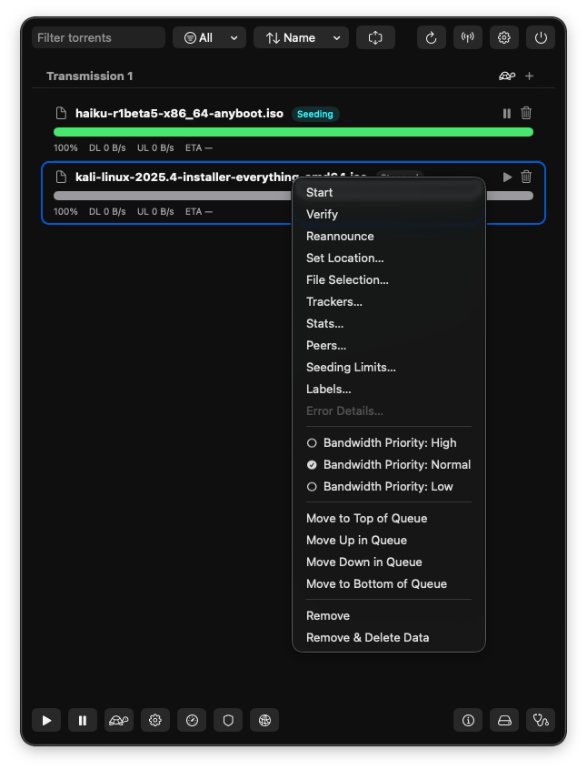

# Transmissioner


macOS menu bar client for remote controlling
[Transmission](https://transmissionbt.com/) servers.



## Features

Transmissioner aims to expose as many Transmission RPC features as possible
through a native macOS interface.

- Manage torrents: start/stop, verify, reannounce
- Add torrents from magnet link, URL, or `.torrent` file
- Multiple Transmission servers with a grouped per-server view
- Search, sort, filter by status
- Remove torrents (with optional delete data)
- Queue ordering and bandwidth priority
- Session info, free space, diagnostics
- Per-torrent details (files, trackers, peers, stats, labels, seeding limits)
- Global limits and alternate speed schedule

## Install (Homebrew)

```bash
brew tap kluzzebass/tap
brew install --cask transmissioner
```

## Build (local)

```bash
just build
just run
```

## Release

See `RELEASE.md` for the signed + notarized cask release flow.

## License

Copyright © 2026 Jan Fredrik Leversund. All rights reserved.
